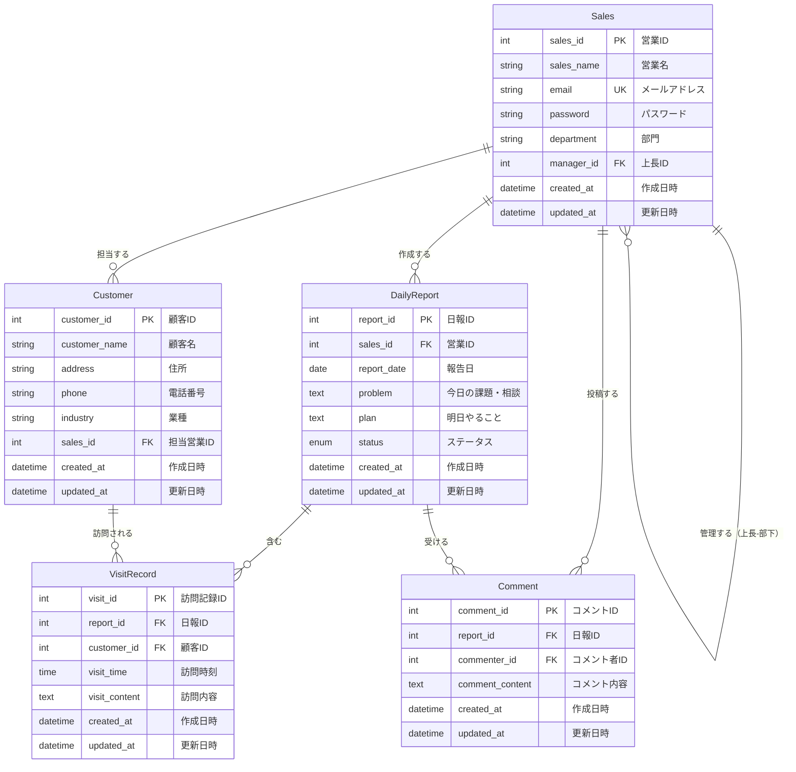
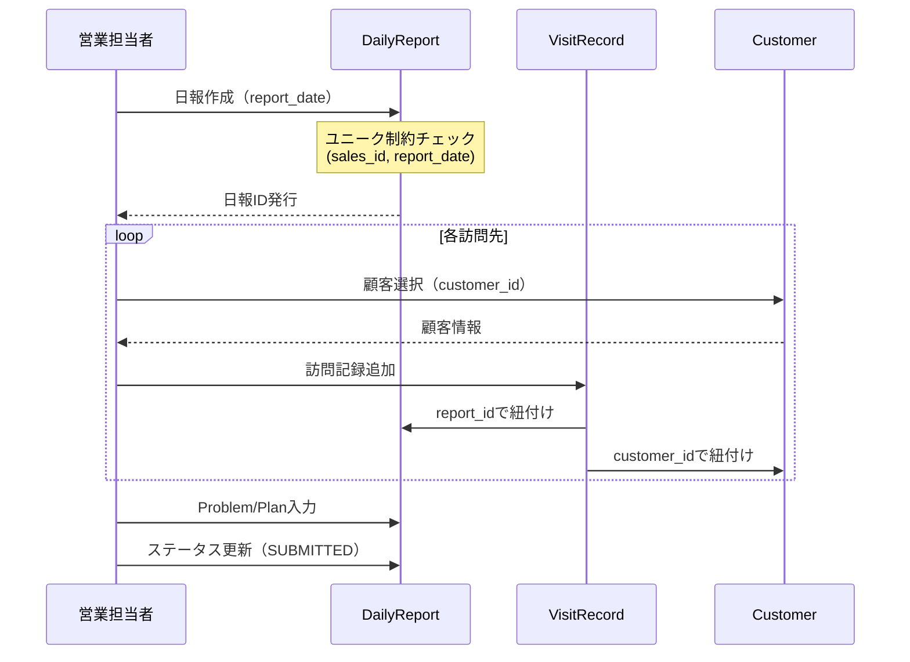
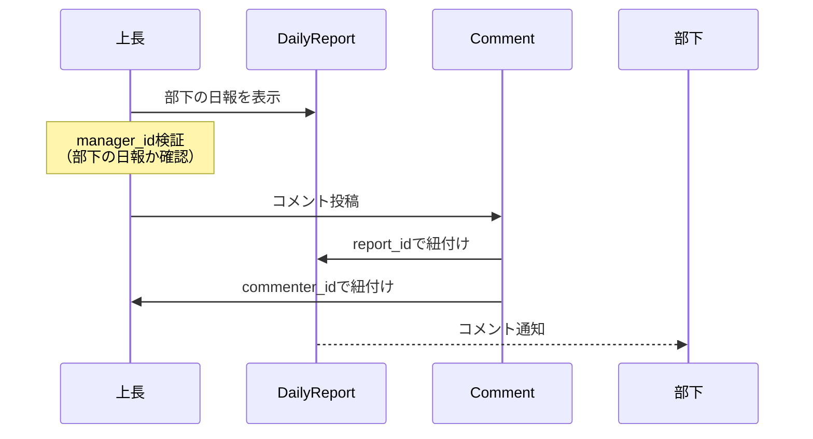

# ER図 - 営業日報システム

## エンティティ関連図（Mermaid）

## エンティティ詳細

### 1. Sales（営業マスタ）

**概要**: 営業担当者の基本情報と組織階層を管理

**主キー**: `sales_id`

**ユニーク制約**: `email`

**外部キー**:

- `manager_id` → `Sales.sales_id` (自己参照関係)

**リレーション**:

- `DailyReport`: 1対多（一人の営業は複数の日報を作成）
- `Customer`: 1対多（一人の営業は複数の顧客を担当）
- `Comment`: 1対多（一人の営業は複数のコメントを投稿）
- `Sales`: 1対多（上長は複数の部下を持つ）

**ビジネスルール**:

- `manager_id`がNULLの場合は最上位の管理者
- 循環参照を防ぐため、自己参照外部キーは`onDelete: NoAction`

---

### 2. Customer（顧客マスタ）

**概要**: 顧客の基本情報を管理

**主キー**: `customer_id`

**外部キー**:

- `sales_id` → `Sales.sales_id`（必須）

**リレーション**:

- `Sales`: 多対1（複数の顧客が一人の営業に担当される）
- `VisitRecord`: 1対多（一つの顧客は複数回訪問される）

**ビジネスルール**:

- 訪問記録が存在する顧客は削除不可

---

### 3. DailyReport（日報）

**概要**: 営業の日次活動報告を管理

**主キー**: `report_id`

**ユニーク制約**: `(sales_id, report_date)` - 1営業につき1日1件

**外部キー**:

- `sales_id` → `Sales.sales_id`（必須）

**リレーション**:

- `Sales`: 多対1（複数の日報が一人の営業に紐づく）
- `VisitRecord`: 1対多（一つの日報は複数の訪問記録を含む）
- `Comment`: 1対多（一つの日報は複数のコメントを受ける）

**ビジネスルール**:

- `status`が`draft`の場合のみ削除可能
- `status`が`submitted`の場合は編集可能だが削除不可
- 日報削除時、訪問記録とコメントもカスケード削除

**列挙型（status）**:

- `DRAFT`: 下書き
- `SUBMITTED`: 提出済

---

### 4. VisitRecord（訪問記録）

**概要**: 日報内の個別顧客訪問情報を管理

**主キー**: `visit_id`

**外部キー**:

- `report_id` → `DailyReport.report_id`（必須、カスケード削除）
- `customer_id` → `Customer.customer_id`（必須）

**リレーション**:

- `DailyReport`: 多対1（複数の訪問記録が一つの日報に紐づく）
- `Customer`: 多対1（複数の訪問記録が一つの顧客に紐づく）

**ビジネスルール**:

- 日報削除時にカスケード削除される
- 顧客は必ず顧客マスタに存在する必要がある

---

### 5. Comment（コメント）

**概要**: 上長が部下の日報に対して行うフィードバックを管理

**主キー**: `comment_id`

**外部キー**:

- `report_id` → `DailyReport.report_id`（必須、カスケード削除）
- `commenter_id` → `Sales.sales_id`（必須）

**リレーション**:

- `DailyReport`: 多対1（複数のコメントが一つの日報に紐づく）
- `Sales`: 多対1（複数のコメントが一人の営業に投稿される）

**ビジネスルール**:

- コメント投稿者は日報作成者の上長である必要がある
- 日報削除時にカスケード削除される

---

## リレーションシップの詳細

### 1. Sales ↔ Sales（自己参照：上長-部下関係）

- **カーディナリティ**: 1対多
- **参照整合性**: `onDelete: NoAction, onUpdate: NoAction`
- **説明**:
  - 一人の上長は複数の部下を持つ
  - 一人の営業は最大一人の上長を持つ
  - `manager_id`がNULLの場合、最上位管理者または独立した営業

### 2. Sales → DailyReport

- **カーディナリティ**: 1対多
- **参照整合性**: デフォルト（削除制限）
- **説明**:
  - 一人の営業は複数の日報を作成できる
  - 一つの日報は必ず一人の営業に紐づく

### 3. Sales → Customer

- **カーディナリティ**: 1対多
- **参照整合性**: デフォルト（削除制限）
- **説明**:
  - 一人の営業は複数の顧客を担当できる
  - 一つの顧客は必ず一人の担当営業を持つ

### 4. DailyReport → VisitRecord

- **カーディナリティ**: 1対多
- **参照整合性**: `onDelete: Cascade`
- **説明**:
  - 一つの日報は複数の訪問記録を含むことができる
  - 日報が削除されると、関連する訪問記録も自動削除される

### 5. Customer → VisitRecord

- **カーディナリティ**: 1対多
- **参照整合性**: デフォルト（削除制限）
- **説明**:
  - 一つの顧客は複数回訪問される可能性がある
  - 顧客は訪問記録がある場合、削除できない

### 6. DailyReport → Comment

- **カーディナリティ**: 1対多
- **参照整合性**: `onDelete: Cascade`
- **説明**:
  - 一つの日報は複数のコメントを受けることができる
  - 日報が削除されると、関連するコメントも自動削除される

### 7. Sales → Comment

- **カーディナリティ**: 1対多
- **参照整合性**: デフォルト（削除制限）
- **説明**:
  - 一人の営業（上長）は複数のコメントを投稿できる
  - 一つのコメントは必ず一人の投稿者を持つ

---

## インデックス設計

### Sales

- `PRIMARY KEY`: `sales_id`
- `UNIQUE INDEX`: `email`
- `INDEX`: `manager_id` (階層検索の最適化)

### Customer

- `PRIMARY KEY`: `customer_id`
- `INDEX`: `sales_id` (担当営業での検索)

### DailyReport

- `PRIMARY KEY`: `report_id`
- `UNIQUE INDEX`: `(sales_id, report_date)` (重複防止)
- `INDEX`: `sales_id` (営業での検索)
- `INDEX`: `report_date` (日付での検索)

### VisitRecord

- `PRIMARY KEY`: `visit_id`
- `INDEX`: `report_id` (日報での検索)
- `INDEX`: `customer_id` (顧客訪問履歴検索)

### Comment

- `PRIMARY KEY`: `comment_id`
- `INDEX`: `report_id` (日報のコメント取得)
- `INDEX`: `commenter_id` (投稿者での検索)

---

## データフロー図

### 日報作成フロー

### コメント投稿フロー

---

## 正規化レベル

このスキーマは**第3正規形（3NF）**に準拠しています：

### 第1正規形（1NF）

✅ 全ての列が原子値（分割不可能な値）

### 第2正規形（2NF）

✅ 全ての非キー属性が主キーに完全関数従属

### 第3正規形（3NF）

✅ 全ての非キー属性が主キーに推移的関数従属していない

---

## 拡張可能性

将来的に追加可能な機能：

1. **役職マスタ（Role）**: Sales に role_id を追加
2. **商品マスタ（Product）**: VisitRecord に product_id を追加
3. **添付ファイル（Attachment）**: DailyReport や VisitRecord に紐づく
4. **タグ機能（Tag）**: Customer や DailyReport の多対多関係
5. **通知履歴（Notification）**: コメント投稿時の通知管理
6. **活動履歴（ActivityLog）**: 全エンティティの変更履歴追跡

---

## 制約一覧

| テーブル    | 制約タイプ  | カラム                  | 説明                     |
| ----------- | ----------- | ----------------------- | ------------------------ |
| Sales       | PRIMARY KEY | sales_id                | 主キー                   |
| Sales       | UNIQUE      | email                   | メールアドレスの重複禁止 |
| Sales       | FOREIGN KEY | manager_id              | 上長への参照（自己参照） |
| Customer    | PRIMARY KEY | customer_id             | 主キー                   |
| Customer    | FOREIGN KEY | sales_id                | 担当営業への参照         |
| DailyReport | PRIMARY KEY | report_id               | 主キー                   |
| DailyReport | UNIQUE      | (sales_id, report_date) | 1営業1日1件              |
| DailyReport | FOREIGN KEY | sales_id                | 営業への参照             |
| VisitRecord | PRIMARY KEY | visit_id                | 主キー                   |
| VisitRecord | FOREIGN KEY | report_id               | 日報への参照（CASCADE）  |
| VisitRecord | FOREIGN KEY | customer_id             | 顧客への参照             |
| Comment     | PRIMARY KEY | comment_id              | 主キー                   |
| Comment     | FOREIGN KEY | report_id               | 日報への参照（CASCADE）  |
| Comment     | FOREIGN KEY | commenter_id            | 投稿者への参照           |

---

## 使用技術

- **ORM**: Prisma.js
- **データベース**: PostgreSQL
- **言語**: TypeScript
- **フレームワーク**: Next.js (App Router)
- **デプロイ**: Google Cloud Run
